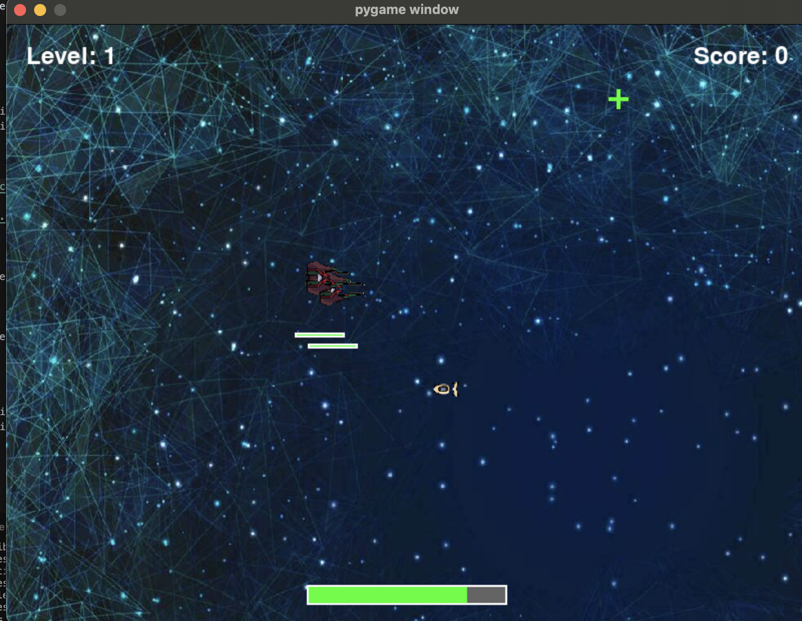

# Assignment 3

## Question 1 (Image Editor Application)

### Requirements:

- Python 3.x (Tested on Python 3.13)
- Tkinter
- OpenCV
- PIL (11.2.1)

### How to run the code:

1. Clone the repository
2. Run the code using `python editor.py`

### Screenshots:

#### Image Editor Homepage

#### Image Editor Grayscale

#### Image Editor Rotate

## Question 2 (Game Application)

### Requirements:

- Python 3.x (Tested on Python 3.10.16)
- pygame (2.6.1)

### How to run the code:

1. Clone the repository
2. Run the code using `python game.py`

### Screenshots:

#### Game Homepage

#### Gameplay

#### Game Over

